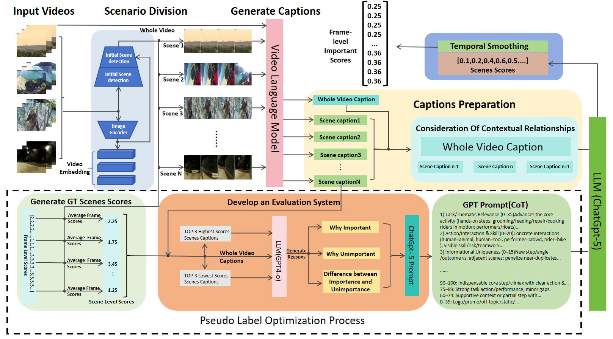
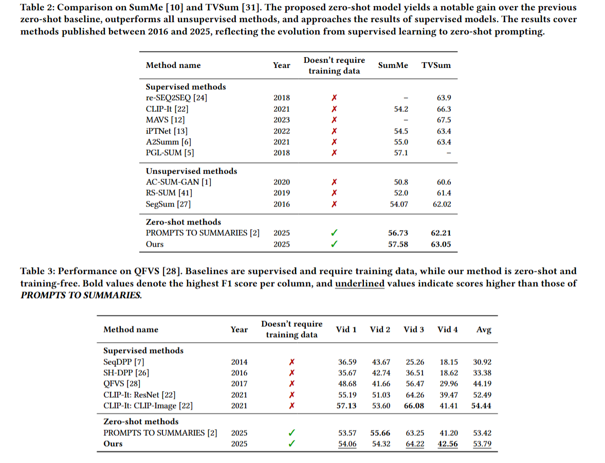

# 🎬 Context-Aware Pseudo-Label Scoring for Zero-Shot Video Summarization
[]()
[]()
[]()
[]()

This repository implements a **rubric-guided zero-shot video summarization framework**.  
It supports experiments on **TVSum**, **SumMe**, and **QFVS**, including the complete pipeline:

- **Reason Generation** 
- **Core Scoring Module** 
- **Evaluation** 

---

## 📑 Table of Contents

- [Features](#✨ Features)
- [Project Structure](#📂 Project Structure)
- [Environment Setup](#🛠 Environment Setup)
- [Dataset Preparation](#📁 Dataset Preparation)
  - [TVSum](#tvsum)
  - [SumMe](#summe)
  - [QFVS](#qfvs)
- [Pipeline Overview](#pipeline-overview)
  - [1. Reason Generation](#1️⃣-reason-generation)
  - [2. Core Scoring Module](#2️⃣-core-scoring-module)
  - [3. Evaluation](#3️⃣-evaluation)
- [Full End-to-End Example](#full-end-to-end-example)
- [Results](#results)
- [Citation](#citation)
- [License](#license)
- [Acknowledgements](#acknowledgements)

---



📄 Paper: https://arxiv.org/abs/2510.17501

## ✨ Features

- 🚫 **Zero-shot pipeline** (no supervised training)
- 📊 Evaluated on **TVSum / SumMe / QFVS**
- 🧠 Rubric-guided LLM scoring with contextual reasoning
- 📈 Supports frame-level & segment-level outputs
- ⚙ Config-based pipeline, easy to reproduce
- 🔍 Clean modular design (Reason → Scoring → Evaluation)

---

## 📂 Project Structure

├── Data_Evaluation/

│   ├── evaluation/
│   ├── scripts/
│   └── splits/
│   ├── sumMe_mapping.json

│   └── tvSum_mapping.json

├── Generate_Reason/

│   ├── QFVS-reason-generation.py
│   └── TVSum_and_Summe_Generation.py
├── QFVS/
│   ├── evaluation/
│   ├── GFVS_splits.py

│   ├── QFVS_mapping.py

│   ├── QFVS_mapping.json

│   └── QFVS_splits.json

├── src/
│   ├──model/
│   └── utils.py
├── requirements.txt
└── README.md

## 🛠 Environment Setup

Clone and install:

```bash
git clone https://github.com/<yourname>/<your-project>.git
cd <your-project>
pip install -r requirements.txt
export OPENAI_API_KEY="YOUR_KEY"
```

## 📁 Dataset Preparation

## Dataset Preparation

### TVSum  
Download the official TVSum dataset here:  
https://people.csail.mit.edu/yalesong/tvsum/tvsum50_ver_1_1.tgz  

Note: This archive contains the 50 videos, along with shot-level annotations for importance and metadata.  

### SumMe  
Download the SumMe dataset here:  
https://data.vision.ee.ethz.ch/cvl/SumMe/SumMe.zip  

Note: This includes the original videos and ground truth summary annotations.  

### QFVS (Query-Focused Video Summarization)  
A publicly-available version of QFVS is hosted on Hugging Face (ToughStone / QFVS collection):  
https://huggingface.co/ToughStone/QFVS  

You can load the data via Hugging Face datasets API or download the files directly.  

## 🔄 Pipeline Overview

### 1️⃣ **Reason Generation**

------

This part of the reason-generation process requires **pre-computed segment scores** before the explanations can be produced.
 The chain-of-thought (CoT) reasoning is generated using **GPT-5**, and the resulting explanations have already been integrated into the downstream scoring pipeline.

Therefore, this script is provided **for documentation and demonstration purposes only** and does **not** affect the subsequent scoring process.

### TVSUM/SUMME Reason Generation

```bash
python Generate_Reason/generate_reasons.py \
  --scores_all outputs/scene_scores_results.json \
  --descs_dir data/descriptions/ \
  --out_dir outputs/reasons/per_video/ \
  --batch_out outputs/reasons/reasons_all.json \
  --model gpt-5 \
  --limit 10 \
  --k_high 3 \
  --k_low 3
```

### QFVS Reason Generation

```bash
python Generate_Reason/rank_segments_by_gt_points.py \
  --gt data/tvsum/gt_points/video01_points.txt \
  --segments_json data/tvsum/segments/video01_segments.json \
  --descs_json data/tvsum/descriptions/video01_descs.json \
  --k_high 3 \
  --k_low 3 \
  --model gpt-5 \
  --out outputs/reasons_gt/video01_reasons.json
```

### 2️⃣ **Core Scoring Module**

### TVSum Scoring Generation

```bash
python src/model/solver_TVSum.py \
  --video_name sample \
  --video_type mp4 \
  --video_dir ./videos \
  --work_dir ./results \
  --openai_key YOUR_API_KEY
```

```bash
python src/model/solver_TVSum_CoT \
  --video_name sample \
  --video_type mp4 \
  --video_dir ./videos \
  --work_dir ./results \
  --openai_key YOUR_API_KEY
```

```bash
python src/model/solver_TVSum_CoT_Context \
  --video_name sample \
  --video_type mp4 \
  --video_dir ./videos \
  --work_dir ./results \
  --openai_key YOUR_API_KEY
```

### SumMe Scoring Generation

```bash
python src/model/solver_Summe.py \
  --video_name sample \
  --video_type mp4 \
  --video_dir ./videos \
  --work_dir ./results \
  --openai_key YOUR_API_KEY
```

```bash
python src/model/solver_Summe_CoT.py \
  --video_name sample \
  --video_type mp4 \
  --video_dir ./videos \
  --work_dir ./results \
  --openai_key YOUR_API_KEY
```

```bash
python src/model/solver_Summe_CoT_Context.py \
  --video_name sample \
  --video_type mp4 \
  --video_dir ./videos \
  --work_dir ./results \
  --openai_key YOUR_API_KEY
```


### QFVS Scoring Generation

```bash
python src/model/QFVS_solver.py \
  --openai_key YOUR_API_KEY \
  --video_name P01 \
  --video_dir ./videos \
  --video_type mp4 \
  --work_dir ./results
```

```bash
python src/model/QFVS_solver_CoT.py \
  --openai_key YOUR_API_KEY \
  --video_name P01 \
  --video_dir ./videos \
  --video_type mp4 \
  --work_dir ./results
```

```bash
python src/model/QFVS_solver_CoT_Context.py \
  --openai_key YOUR_API_KEY \
  --video_name P01 \
  --video_dir ./videos \
  --video_type mp4 \
  --work_dir ./results
```

### 3️⃣ **Evaluation**

### TVSum\SumMe Evaluation

```bash
python Data_Evaluation/evaluation/eval.py \
  --work_dir ./results/hparam_search/summe_minmax \
  --gt_file ./data/SumMe/gt_scores.mat \
  --splits_file ./data/SumMe/splits.json \
  --mapping_file ./configs/summe_mapping.json \
  --meta_data_dir ./meta/summe \
  --metric summe \
  --norm MinMax
```


### QFVS Evaluation

```bash
python QFVS/evaluation/QFVS_eval.py \
  --work_dir ./results/QFVS_eval_raw \
  --splits_file ./data/QFVS/splits_qfvs.json \
  --mapping_file ./configs/qfvs_mapping.json \
  --Tags_file ./data/QFVS/Tags.mat \
  --gt_dir ./data/QFVS/gt \
  --meta_data_dir ./meta/QFVS \
  --norm None
```


## 📊 Results



## 📚 Citation

@article{wu2025contextaware,
  title={Context-Aware Pseudo-Label Scoring for Zero-Shot Video Summarization},
  author={Wu, Yuanli and Yuen, Chau and others},
  journal={arXiv preprint arXiv:2510.17501},
  year={2025}
}

## 📄 License

This project is licensed under the **MIT License**.